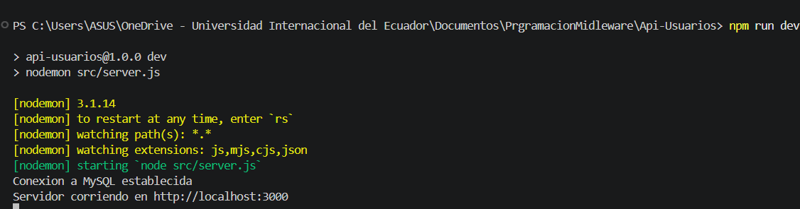
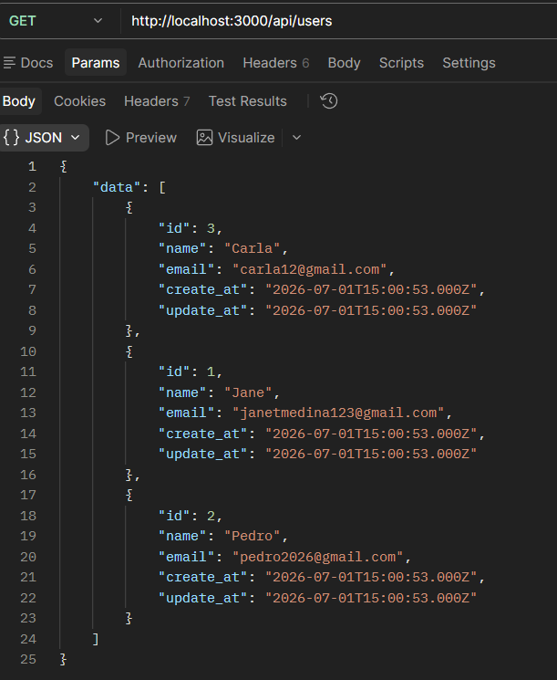
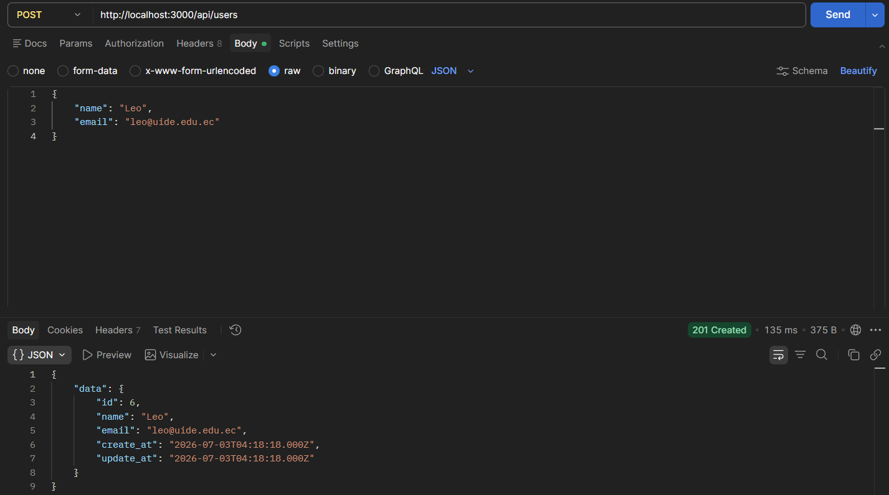
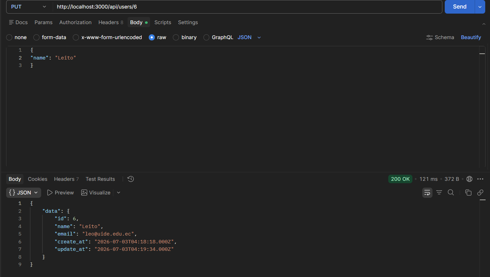
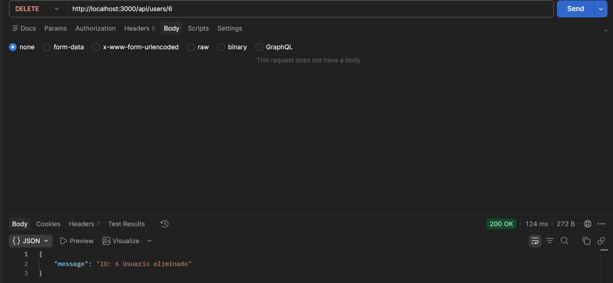
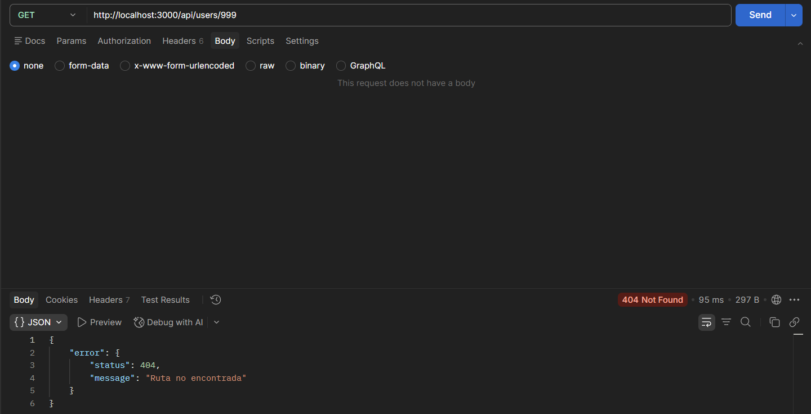

### Servidor corriendo 

### Ejecucion de las 5 operaciones
### Get
### curl: http://localhost:3000/api/users

### Post
### curl: http://localhost:3000/api/users/

### Put
### curl: http://localhost:3000/api/users/6

### Delete
### curl: http://localhost:3000/api/users/6

### Get 999
### curl: http://localhost:3000/api/users/999
